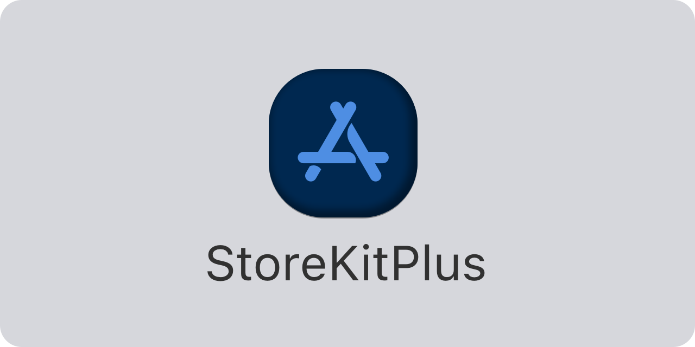

<p align="center">
    
</p>

<p align="center">
        
    
    
    
        <a href="https://twitter.com/danielsaidi">
        
    </a>
    <a href="https://mastodon.social/@danielsaidi">
        
    </a>
</p>


## About StoreKitPlus

StoreKitPlus is a Swift SDK that makes it easy to integrate with StoreKit 2.

StoreKitPlus has an observable ``StoreContext`` that lets you observe store state, services that let you fetch, purchase and sync products, as well as a ``ProductRepresentable`` protocol that lets you use local product representations in your app.


## Installation

StoreKitPlus can be installed with the Swift Package Manager:

```
https://github.com/danielsaidi/StoreKitPlus.git
```


## Getting started

See the online [getting started guide][Getting-Started] for information on how to get started.


## Documentation

The online [documentation][Documentation] has more information, articles, code examples, etc.


## Support my work

You can [sponsor me][Sponsors] on GitHub Sponsors or [reach out][Email] for paid support, to help support my [open-source projects][OpenSource].

Your support makes it possible for me to put more work into these projects and make them the best they can be.


## Contact

Feel free to reach out if you have questions or if you want to contribute in any way:

* Website: [danielsaidi.com][Website]
* Mastodon: [@danielsaidi@mastodon.social][Mastodon]
* Twitter: [@danielsaidi][Twitter]
* E-mail: [daniel.saidi@gmail.com][Email]


## License

StoreKitPlus is available under the MIT license. See the [LICENSE][License] file for more info.


[Email]: mailto:daniel.saidi@gmail.com

[Website]: https://danielsaidi.com
[GitHub]: https://github.com/danielsaidi
[Twitter]: https://twitter.com/danielsaidi
[Mastodon]: https://mastodon.social/@danielsaidi
[OpenSource]: https://danielsaidi.com/opensource
[Sponsors]: https://github.com/sponsors/danielsaidi

[Documentation]: https://danielsaidi.github.io/StoreKitPlus
[Getting-Started]: https://danielsaidi.github.io/StoreKitPlus/documentation/storekitplus/getting-started

[License]: https://github.com/danielsaidi/StoreKitPlus/blob/master/LICENSE
