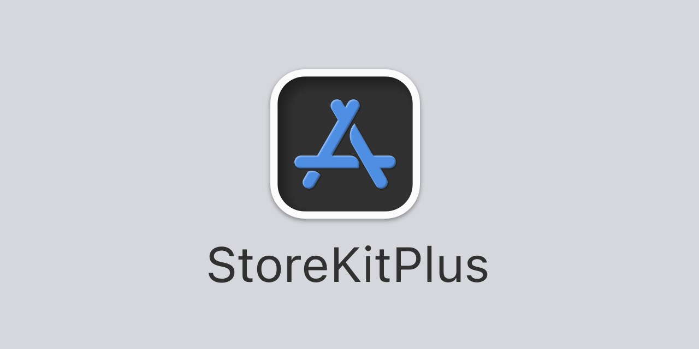

<p align="center">
    
</p>

<p align="center">
    
    
    
    
    <a href="https://twitter.com/danielsaidi">
        
    </a>
</p>


## About StoreKitPlus

StoreKitPlus adds extra functionality for working with StoreKit 2, like extensions, observable state, services, etc. 

StoreKitPlus has an observable ``StoreContext`` that lets you observe store state, service protocols and implementations that let you fetch, purchase and sync products, as well as a ``ProductRepresentable`` protocol that lets you add a local product representation to your app.


## Supported Platforms

StoreKitPlus supports `iOS 15`, `macOS 12`, `tvOS 15` and `watchOS 8`.


## Installation

StoreKitPlus can be installed with the Swift Package Manager:

```
https://github.com/danielsaidi/StoreKitPlus.git
```

or with CocoaPods:

```
pod StoreKitPlus
```

You can also clone the repository and build the library locally.


## Getting started

The StoreKitPlus online documentation has a [getting-started guide][Getting-Started] that will help you get started with the library.


## Documentation

The [online documentation][Documentation] has articles, code examples etc. that let you overview the various parts of the library.

The online documentation is currently iOS-specific. To generate documentation for other platforms, open the package in Xcode, select a simulator then run `Product/Build Documentation`.


## Demo Application

This project currently has no demo app, since registering and testing real products requires setting up App Store Connect with your products.

Just let me know if you'd like a demo app, and I'll see if I can create an app that has a local StoreKit file and doesn't have to sync with App Store Connect. 


## Support

You can sponsor this project on [GitHub Sponsors][Sponsors] or get in touch for paid support.


## Contact

Feel free to reach out if you have questions or if you want to contribute in any way:

* E-mail: [daniel.saidi@gmail.com][Email]
* Twitter: [@danielsaidi][Twitter]
* Web site: [danielsaidi.com][Website]


## License

StoreKitPlus is available under the MIT license. See [LICENSE][License] file for more info.


[Email]: mailto:daniel.saidi@gmail.com
[Twitter]: http://www.twitter.com/danielsaidi
[Website]: http://www.danielsaidi.com
[Sponsors]: https://github.com/sponsors/danielsaidi

[Documentation]: https://danielsaidi.github.io/StoreKitPlus/documentation/storekitplus/
[Getting-Started]: https://danielsaidi.github.io/StoreKitPlus/documentation/storekitplus/getting-started
[License]: https://github.com/danielsaidi/StoreKitPlus/blob/master/LICENSE
