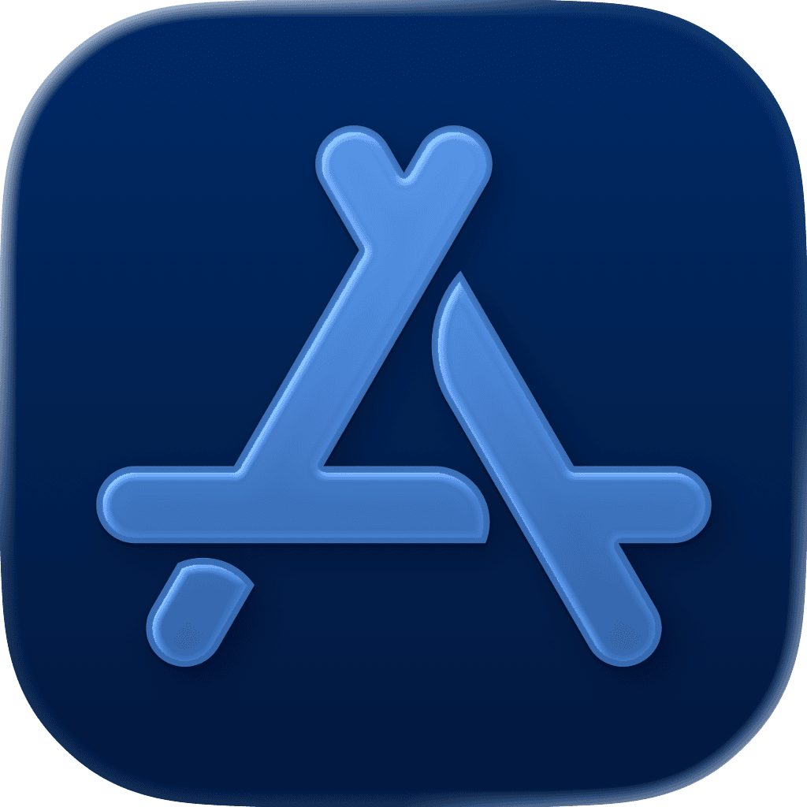

<p align="center">
    
</p>

<p align="center">
        
    
    <a href="https://danielsaidi.github.io/StoreKitPlus"></a>
    <a href="https://github.com/danielsaidi/StoreKitPlus/blob/master/LICENSE"></a>
    <a href="https://github.com/sponsors/danielsaidi"></a>
</p>


# StoreKitPlus

StoreKitPlus is a Swift library that makes it easier to use StoreKit 2 in Swift and SwiftUI.

StoreKitPlus has a `StoreContext` that lets you observe store state, services that let you fetch, purchase and sync products, and a `ProductRepresentable` protocol that lets you use local product representations in your app.


## Installation

StoreKitPlus can be installed with the Swift Package Manager:

```
https://github.com/danielsaidi/StoreKitPlus.git
```


## Support My Work

You can [become a sponsor][Sponsors] to help me dedicate more time on my various [open-source tools][OpenSource]. Every contribution, no matter the size, makes a real difference in keeping these tools free and actively developed.


## Getting started

See the online [getting started guide][Getting-Started] for information on how to get started.


## Documentation

The online [documentation][Documentation] has more information, articles, code examples, etc.


## Contact

Feel free to reach out if you have questions or if you want to contribute in any way:

* Website: [danielsaidi.com][Website]
* E-mail: [daniel.saidi@gmail.com][Email]
* Bluesky: [@danielsaidi@bsky.social][Bluesky]
* Mastodon: [@danielsaidi@mastodon.social][Mastodon]


## License

StoreKitPlus is available under the MIT license. See the [LICENSE][License] file for more info.


[Email]: mailto:daniel.saidi@gmail.com
[Website]: https://danielsaidi.com
[GitHub]: https://github.com/danielsaidi
[OpenSource]: https://danielsaidi.com/opensource
[Sponsors]: https://github.com/sponsors/danielsaidi

[Bluesky]: https://bsky.app/profile/danielsaidi.bsky.social
[Mastodon]: https://mastodon.social/@danielsaidi
[Twitter]: https://twitter.com/danielsaidi

[Documentation]: https://danielsaidi.github.io/StoreKitPlus
[Getting-Started]: https://danielsaidi.github.io/StoreKitPlus/documentation/storekitplus/getting-started
[License]: https://github.com/danielsaidi/StoreKitPlus/blob/master/LICENSE
